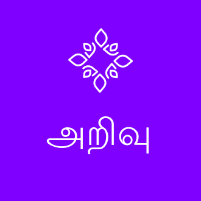

# Arivu Marp Theme



**Arivu** is a custom CSS theme for [Marp](https://marp.app/) designed for creating professional and beautiful presentations. It builds on the `gaia` theme and imports some classes from the [Awesome Marp](https://github.com/favourhong/Awesome-Marp) theme.

## ✨ Features

*   **50+ Slide Layouts:** A wide variety of styles for bullet points, cards, panels, timelines, and more.
*   **Animated Backgrounds:** Three cinematic background modes — `vortex`, `aurora`, and `ember`.
*   **Soft Fragments:** Use `softfrag` for smooth per-item reveal animations.
*   **Customizable:** Easily add headers, footers, and logos.
*   **Icon Support:** Use GitHub emoticons or Font Awesome icons in your slides.
*   **Special Effects:** Animations like `shine`, `crawl`/`marchants`, `frost`, and `slidein`.
*   **Video Backgrounds:** Embed videos as slide backgrounds using the `screen` class.

## 🚀 Quick Start

1.  **Install Marp:** Get the [Marp for VS Code extension](https://marketplace.visualstudio.com/items?itemName=marp-team.marp-vscode) or the [Marp CLI](https://marp.app/).

2.  **Add the Theme:** In VS Code's Marp extension settings, add the following URL to `Markdown: Marp > Themes`:
    ```
    https://gsm-arivu.github.io/css/arivu.css
    ```

3.  **Set the Theme in Your Markdown:**
    ```markdown
    ---
    marp: true
    theme: arivu
    ---
    ```

## 🎨 Animated Backgrounds

Prefix any layout class with one of the three animated background classes:

| Class | Effect |
|-------|--------|
| `vortex` | Dark swirling vortex animation |
| `aurora` | Northern lights colour-wash |
| `ember` | Glowing embers / fire effect |

Example: `<!-- _class: vortex box softfrag -->`

## 🧩 Available Layouts

Apply a class to a slide to change its style. For example: `<!-- _class: box -->`

### Bullet Styles
| Class | Description |
|-------|-------------|
| `box` | Coloured box bullets |
| `capsule` | Pill/capsule shaped bullets |
| `white` | Clean white bullets |
| `white_circle` | White circle bullets |
| `white_delta` | White triangle/delta bullets |
| `glass` | Frosted glass bullets |
| `neon` | Neon glow bullets |

### Card & Grid Layouts
| Class | Description |
|-------|-------------|
| `card` | Simple card grid |
| `card_color` | Coloured card grid |
| `card_color_round` | Rounded coloured cards |

### Panel Layouts
| Class | Description |
|-------|-------------|
| `panel` | Icon + description panels |
| `panel_card` | Card-style panels |
| `panel_transparent` | Transparent panels |
| `panel_capsule` | Capsule-shaped panels |
| `panel_shirt` | Shirt-shaped panels |
| `panel_pillar` | Pillar-style panels |

Add `frost` to any panel class for a frosted-glass overlay: `<!-- _class: panel frost -->`

### Icon Layouts
| Class | Description |
|-------|-------------|
| `icon_box` | Icon in a box |
| `icon_capsule` | Icon in a capsule |
| `icon_card` | Icon card (title + body) |
| `icon_flower` | Icon flower arrangement |
| `icon_pillar` | Icon pillar (3×2 grid) |
| `icon_pillar4` | Icon pillar (2×2 grid) |
| `icon_shirt` | Icon shirt (3×2 grid) |
| `icon_shirt4` | Icon shirt (2×2 grid) |

### Timeline & Process Layouts
| Class | Description |
|-------|-------------|
| `timeline` | Horizontal timeline with year labels |
| `timeline2` | Icon-based timeline |
| `roadmap` | Top-to-bottom roadmap |
| `roadmap2` | Bottom-to-top roadmap |
| `chevron` | Chevron process flow |
| `stairs` | Stair-step progression |

### Decorative Shapes
| Class | Description |
|-------|-------------|
| `hexagon` | Hexagon bullets |
| `caterpillar` | Caterpillar chain |
| `triangle` | Triangle bullets |
| `arrow` | Arrow bullets |
| `flower` | Flower arrangement |
| `zigsaw` | Zigzag/jigsaw layout |
| `paintbrush` | Paintbrush strokes |
| `pyramid` | Pyramid (top to bottom) |
| `pyramid2` | Pyramid (bottom to top) |

### Other Layouts
| Class | Description |
|-------|-------------|
| `ribbon` | Ribbon banners |
| `ticket` | Ticket stubs |
| `chat` | Chat bubbles |
| `tag` | Label tags |
| `leaf` | Leaf pairs |
| `bookmark` | Bookmark ribbons |
| `fold` | Sticky notes |
| `fa` | Font Awesome icon list |
| `bq-purple` | Purple blockquote callout |
| `bq-blue` | Blue blockquote callout |

## 🎬 Special Effects

Combine these modifier classes with any layout:

| Class | Effect |
|-------|--------|
| `softfrag` | Fade-in each list item on click |
| `shine` | Adds a glow / shimmer effect |
| `frost` | Frosted-glass overlay on panels |
| `marchants` / `crawl` | Scrolling marquee animation |
| `slidein` | Slide-in entrance animation |
| `screen` + `bg-video` | Full-slide video background |

## 📁 Included Files

*   `css/arivu.css` — The theme file.
*   `markdown/arivu-theme-example.md` — A comprehensive two-part example presentation (Part 1: dark animated, Part 2: traditional).
*   `vs code/snippets/markdown.code-snippets` — VS Code snippets for faster authoring.

## :tv: Preview

Visit [https://gsm-arivu.github.io](https://gsm-arivu.github.io) to see how the markdown is rendered in HTML.

## 📜 License

This project is licensed under the MIT License.
